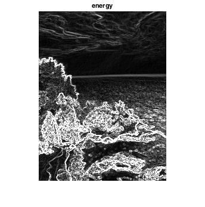
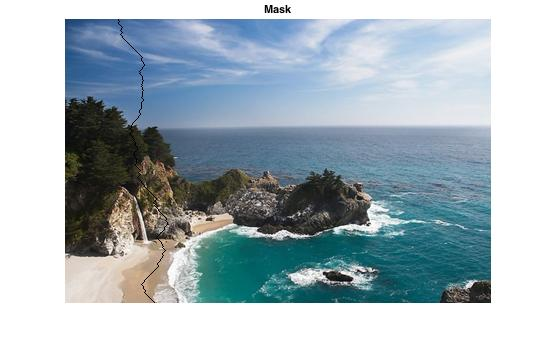
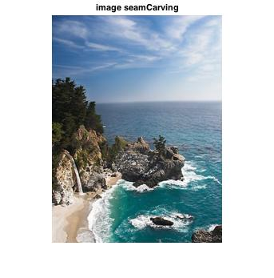
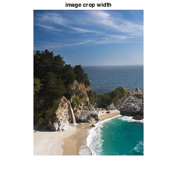
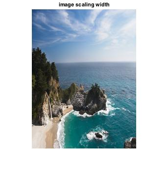

# 張植鈞 <span style="color:red">(student ID: 102061214)</span>

# Project 3 / Seam Carving for Content-Aware Image Resizing

## Overview
The goal of this project is to implement Seam Carving algorithm by matlab,and use content-aware resizing to remove or add pixels which has less meaning while saving more important.

## Implementation and Details
1.Define an energy function that would map a pixel into energy value(energyRGB.m)

energy:


```
Ix = imfilter(I, [-1,0,1], 'replicate');
Iy = imfilter(I, [-1;0;1], 'replicate');
energy = abs(Ix) + abs(Iy);
```
e.g.



2.Determine the seam (findOptSeam.m)

Delete columns/rows with minimum energy to get the seam and then find a seam with the minimum energy among all of them.

```
for i = 2 : size(M,1)
    for j = 2 : (size(M,2) - 1)
        M(i, j) = M(i, j) + min([M(i - 1, j - 1) M(i - 1, j) M(i - 1, j + 1)]);
    end
end
[seamEnergy, indJ] = min(M(size(M,1)), :));
```

e.g.



3.Remove selected seams from the image (reduceImageByMask.m)

There are vertical and horizontal seams so we have deal with them respectively. For vertical seams;

```
for i = 1 : size(seamMask, 1)
    imageReduced(i, :, 1) = image(i, seamMask(i, :), 1);
    imageReduced(i, :, 2) = image(i, seamMask(i, :), 2);
    imageReduced(i, :, 3) = image(i, seamMask(i, :), 3);
end
```

4.Find optimal order of deleting seams (findTransportMatrix)

Use dynamic programming to reduce the size of the image in both directions. There are some parameters:

T(transport matrix): the cost of the optimal sequence of horizontal and vertical seam removal operations for every n’ x m’ 

r = n - n’: number of horizontal

c = m - m’: number of vertical removal operations

TBM(r x c): a map specifying for every T(i, j) decides what seam removal operations we need to use(horizontal (0) or vertical (1))

5.Enlarging an image

Instead of deleting seam, we copy average between neighbors.

## Installation
* How to compile from source?

Compile and run seamCarvingTester.m in Matlab

* Usage: 

energy = energyRGB(I)

[optSeamMask, seamEnergy] = findOptSeam(energy)

imageReduced = reduceImageByMask( image, seamMask, isVertical)

[image, optSeamMask, energy] = seamCarving(image, newSize)

[image, optSeamMask, energy] = DeleteSeams(transBitMask, sizeReduction, image, operation)

### Results








